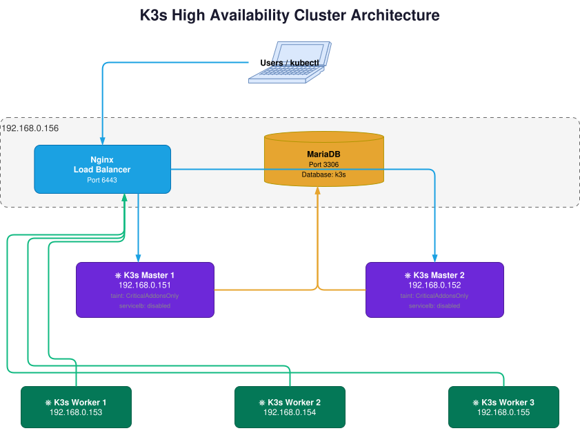

# k8s-HA



## LoadBalancer for k8s

Create a nginx config file `nginx.conf` <br>
`192.168.0.151` and `192.168.0.152` are the IP of the k8s Master nodes

```nginx
events {}

stream {
  upstream k3s_servers {
    server 192.168.0.151:6443;
    server 192.168.0.152:6443;
  }

  server {
    listen 6443;
    proxy_pass k3s_servers;
  }
}
```

Create nginx docker container

```docker
services:
  nginx-lb:
    image: nginx:latest
    container_name: nginx-lb
    restart: always
    ports:
      - "6443:6443"
    volumes:
      - ./nginx.conf:/etc/nginx/nginx.conf:ro
```


## Create a DB for k8s

```docker
services:

  db:
    image: mariadb
    restart: always
    environment:
      MARIADB_ROOT_PASSWORD: <insert_password_here>
      MARIADB_USER: dbuser
      MARIADB_PASSWORD: <insert_password_here>
      MARIADB_DATABASE: k3s
    ports:
      - 3306:3306
    volumes:
      - ./data:/var/lib/mysql:Z
        
  adminer:
    image: adminer
    restart: always
    ports:
      - 8080:8080
```

For cleanup of DB
```bash
docker compose down && rm -rf ./data/* && docker compose up -d
```


## k8s - Master - 1
IP of  the machine where the nginx and DB are located `192.168.0.156` 
```bash
export K3S_DATASTORE_ENDPOINT='mysql://dbuser:<insert_password_here>@tcp(192.168.0.156:3306)/k3s'

curl -sfL https://get.k3s.io | sh -s - server \
--disable servicelb \
--node-taint CriticalAddonsOnly=true:NoExecute \
--tls-san 192.168.0.156

sudo k3s kubectl get nodes

sudo cat /var/lib/rancher/k3s/server/node-token
```

## k8s - Master - 2
```bash
export K3S_DATASTORE_ENDPOINT='mysql://dbuser:<insert_password_here>@tcp(192.168.0.156:3306)/k3s'

curl -sfL https://get.k3s.io | sh -s - server --token=<token-goes-here> \
--node-taint CriticalAddonsOnly=true:NoExecute \
--tls-san 192.168.0.156 --disable servicelb
```


## k8s - Worker - 1
```bash
curl -sfL https://get.k3s.io | K3S_URL=https://192.168.0.156:6443 K3S_TOKEN=<token-goes-here> sh -
```


## k8s - Worker - 2
```bash
curl -sfL https://get.k3s.io | K3S_URL=https://192.168.0.156:6443 K3S_TOKEN=<token-goes-here> sh -
```


## k8s - Worker - 3
```bash
curl -sfL https://get.k3s.io | K3S_URL=https://192.168.0.156:6443 K3S_TOKEN=<token-goes-here> sh -
```


## Install metallb
On the Master node run the following commands
```bash
kubectl apply -f https://raw.githubusercontent.com/metallb/metallb/v0.15.3/config/manifests/metallb-native.yaml
```

Create config file `metallb-config.yaml` as shown below. <br>
Choose a free IP pool range available from the router
```yaml
apiVersion: metallb.io/v1beta1
kind: IPAddressPool
metadata:
  name: external-ip-pool
  namespace: metallb-system
spec:
  addresses:
  - 192.168.0.170-192.168.0.175
---
apiVersion: metallb.io/v1beta1
kind: L2Advertisement
metadata:
  name: l2-advert
  namespace: metallb-system
```

Apply the config
```bash
sudo kubectl apply -f metallb-config.yaml
```


## Create a pod and service 

Create a test service with a pod `nginx-svc.yaml`

```
apiVersion: v1
kind: Service
metadata:
  name: nginx-service
spec:
  type: LoadBalancer
  selector:
    app: nginx
  ports:
  - port: 80
    targetPort: 80
---    
apiVersion: v1
kind: Pod
metadata:
  name: nginx
  labels:
    app: nginx
spec:
  containers:
  - name: nginx
    image: nginx
    ports:
    - containerPort: 80
```

```
sudo kubectl apply -f nginx-svc.yaml
```